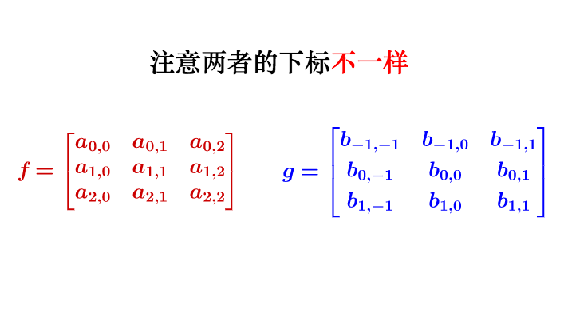

[lenet5](http://yann.lecun.com/exdb/lenet/) 实现了手写数字的识别。其关键在于CNN的使用。其结构如下：

# convolution 
[通俗地理解卷积运算](https://www.matongxue.com/madocs/32.html) 数学表达式：
$$ (f*g)(x) = \int_{-\infty}^\infty f(\tau)g(x-\tau)d\tau $$
可以把$f(x)$理解为信号，$g(x)$理解为发出信号的时机。那么卷积就代表了当前时刻该信号的叠加效果。[在图像中卷积的意义](https://zhuanlan.zhihu.com/p/30994790)。虽然卷积的过程看上去很像内积，但其实两者有很大的区别，两者的前进方向不同。为了方便计算，将g中的下标进行修改，使得卷积运算可以直接用内积来表示。(将g旋转180$\degree$)  
  
卷积后得到的矩阵称为**feature map**  
  
如果特征刚好在角落上，那么上面的卷积过程无法检测到。因此，可以在输入矩阵上填充**padding**。同时使得输入与输出的大小相同。   
也可以控制**stride**来改变卷积核的移动步伐.这会导致**feature map**的尺寸变小。  
设输入的尺寸为 $I_r \times I_c$ , 卷积核尺寸为$K_r \times K_c$, 则可训练参数为$K_r*K_c+1$,输出尺寸为$(I_r+1-K_r) \times (I_c+1-K_c)$.(无padding，stride=1)

## Convolutional Layer
作为神经网络，每一个节点只有2种状态（激活或者未激活）。在感知机中使用sigmoid函数进行激活使得输出值在[0,1]。这一过程被称为**Non-linearity**。

# Pooling Layer
这一过程比较简单，它将原图像进行分割。再对每一个区域进行一次计算。与卷积不同的是，这里的每一块区域都是不重叠的。最终它使得输入尺寸成倍地减少。这一操作称为**subsampling**   
每一层含有2个参数，**coefficient and bias**。同样，作为神经网络中的一层，需要对**subsampling**后的数乘以**coefficient**+**bias** 再用sigmoid函数激活才能输出到网络中。

# Fully-connected (Dense) Layer
这一层与多层神经网络相同，不同的是它的输入可能具有多个**channel**。不管怎么样，都可以将输入看作是一维的。

# Practice
这里我遵照lenet5原始论文进行复现。[材料:数据集+论文](http://yann.lecun.com/exdb/mnist/)
## 预处理
背景色置为-0.1，前景色为1.175. ``(raw-20)/200``
## C1

这里有点奇怪，论文里说输入图像是32X32的，但是数据集是28X28的。  
6个 **zero-padding**5X5的卷积层。有$6*5*5+6(bias)=156$个参数。$6*28*28=4704$个神经元。  
输出：$6\times28\times28$
## S2
大小为：2X2.取区域平均值×系数+bias再sigmoid激活。 参数：$6\times 2$  
输出：$6\times14\times14$
## C3
这里卡了很久，不知道多个feature map 如何进行卷积。其实可以把多个feature map当作多个通道，每个通道上各自进行卷积再叠加在一起。或者说这个卷积具有3维结构（前面都是二维的），只不过其中一维的大小为3，因此正好被压回2维结构。3X14X14的输入，3X5X5的核。
  
参数：3X5X5 6个，4X5X5 6+3个，6X5X5 1个  
输出：16X10X10
## S4
大小为：2X2.取区域平均值×系数+bias再sigmoid激活。  
输出：$16\times5\times5$

## C5
大小为：16X5X5. 共120个。  
输出：120X1
## F6
使用正切函数激活。  
$$ f(a)=A tanh(S*a) $$
A为1.7159.  
输出：84

## output
计算公式：
$$ y_i=\sum_j(x_j-w_{ij})^2 $$
如果模型有k个输出，即k个分类。那么$w_{k*}$代表了该类别在特征空间中的位置。显然，离该特征向量越远，输出越大。这称为**distributed code**
## Loss function

# Appendix
## implement
[参考实现](https://zhuanlan.zhihu.com/p/29716516)
## sigmoid
[wiki](https://en.wikipedia.org/wiki/Sigmoid_function)
它是一类具有形如"S"的函数。常指Logistic function

## BP
[Pooling池化操作的反向梯度传播](https://blog.csdn.net/qq_21190081/article/details/72871704)              
在计算卷积的偏导数时，可以先把不同单元的权值当作是不同的分开计算，最后再把他们加起来。这就好比分身术，先产生n个分身，然后分身再合体回一个。它其实就是一个全微分：
$$ df(x_1,x_2)=f'_{x1} d_{x1}+f'_{x2}d_{x2} $$
如果令$x_1=x_2=x$就得到了上面的方法。                                                                                                                                                                                                                                                                                                                                                                                                                                                                                                                                                                                                                                                                                                                                                                                                                                                                                                                                                                                                                                                                                                                                                                                                                                                                                                                                                                                                                                                                                                                                                                                                                                                                                                                                                                                      