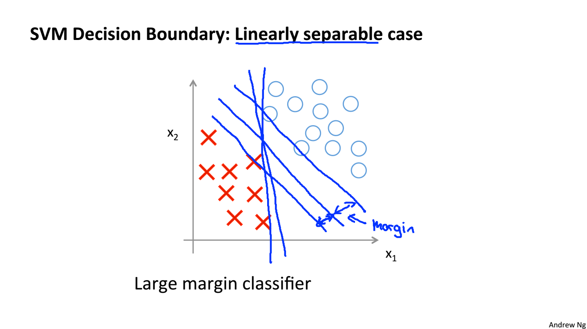
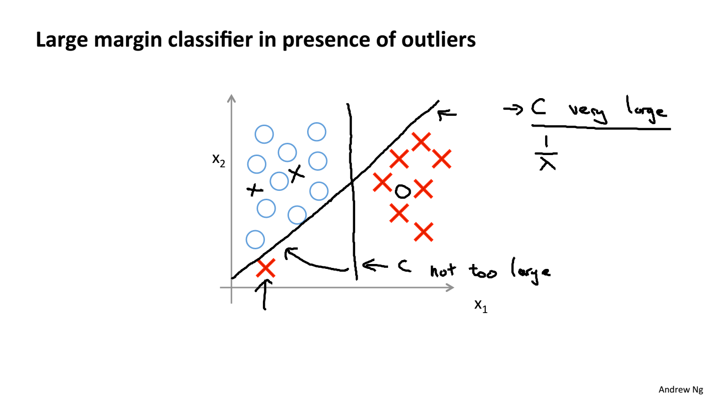
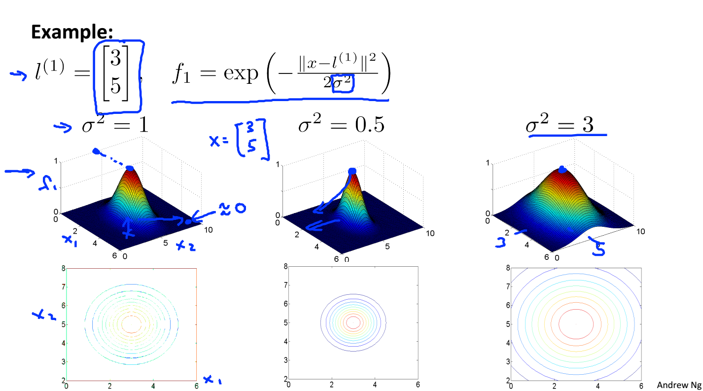

# 基本问题
在一个线性可分的训练集中，求一条直线将2类数据分开，并使得其间隔最大化。

西瓜书P123.
$$ min \frac{1}{2}\left \|  w\right \|^2 $$
$$ s.t. y_i(w^\top x_i+b)\geqslant 1 ,\: i =1,...,m. $$
其中 $y_i=1$ 表示正例，$y_i=-1$表示负例。

## 对偶问题
使用拉格朗日乘子法求得其等价的，也就是对偶问题：
$$ max \sum_{i=1}^m \alpha_i-\frac{1}{2} \sum_{i=1}^m\sum_{j=1}^m \alpha_i \alpha_j y_i y_j \mathbf{x_i^\top}\mathbf{x_j} $$
$$ s.t. \sum_{i=1}^m \alpha_i y_i=0,\: \alpha_i \geq 0 $$
n+1个参数的优化问题变成了m个参数的优化问题。  
要完全理解SVM的计算，需要搞清楚下面两个问题：
1. 原问题如何计算？
2. 对偶问题又如何改进计算？

## 正则化
实际数据并不总是线性可分。即使找到了一个严格可分的平面，也有可能导致过拟合。

引入正则化后的SVM的损失函数（hinge损失）可以表示为：
$$ \min_\theta C\sum_{i=1}^m[y_i cost_1(\mathbf{\theta^\top x_i})+(1-y_i)cost_0(\mathbf{\theta^\top x_i})] + \frac{1}{2} \sum_{j=1}^m \theta_j^2$$
当$C$取无穷大时，等价于严格约束，即找到一条线性可分的直线；  
当$C$取一个适当的值，可以排除一些不符合的数据。

较大的$C$的影响：Lower bias, high variance == small $\lambda$ 过拟合。  
较小的$C$的影响：Higher bias,low variance == large $\lambda$ 欠拟合。

## Logistic regression vs. SVMs
    n = number of features , m = number of training examples 
    If   n  is large (relative to   m  ): n>>m
        Use logistic regression, or SVM without a kernel (“linear kernel”) 
    If   n  is small,     m  is intermediate: 
        Use SVM with Gaussian kernel 
    If   n  is small,     m is large: 
        Create/add more features, then use logistic regression or SVM  without a kernel 
    Neural network likely to work well for most of these secngs, but may be 
    slower to train. 

高斯核的SVM模型复杂度能够随着数据集的增大而增大，但是随着数据增大计算量也快速地提高因此SVM最适合的范围为（n=1~1000, m=10~10000, Andrew）[scikit learn中SVM](https://scikit-learn.org/stable/modules/svm.html)的复杂度为$O(n_{features}*m_{samples}^2)$到$O(n_{features}*m_{samples}^3)$之间。

## 核函数

核函数使得在原特征空间中线性不可分的数据映射到线性可分的特征空间中。可以将训练数据当成标记$l$，如果$x$在$l$附近，那么$f(x,l)$趋于1。这样就能把样本x映射到m维的空间中。在这个空间里描述了样本$x$到各个方向的距离。运用SVM算法，可以选择出有效的支持向量（处在边界上的点）。

    import numpy as np
    y = np.array([0])
    X = np.array([[-6,-6]])
    for i in range(-5,6):
        for j in range(-5,6):
            X = np.append(X,[[i,j]],axis=0)
            y = np.append(y,abs(i)<=3 and abs(j)<=3)

    from sklearn import svm
    clf = svm.SVC(gamma='scale')
    clf.fit(X, y)
    clf.support_vectors_

以上代码SVM在不同样本附近选取特征点，组成支持向量，而不是全部训练样本。 感觉SVM与KNN有一定的相似度。KNN是选择附近数目多的训练样本，而SVM则是对$x$附近的训练样本进行数值加权。