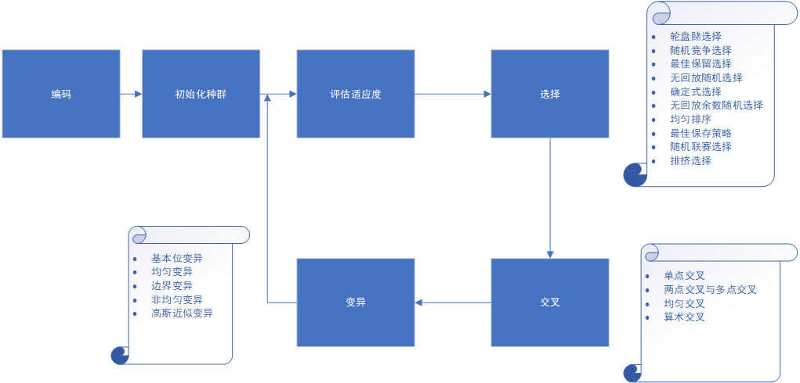
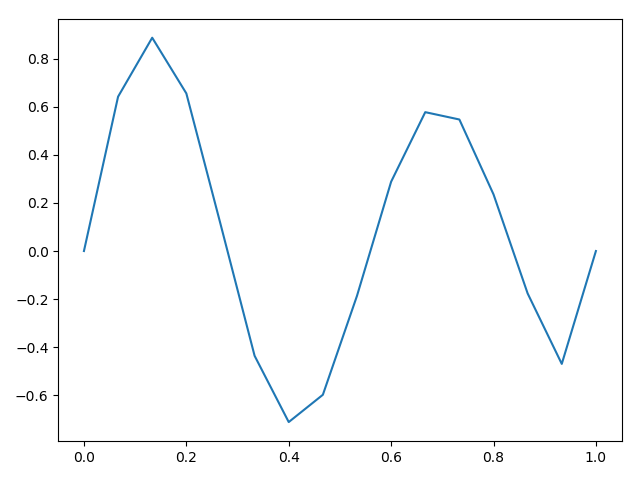

# 算法介绍
遗传算法（Genetic Algorithm, GA）是模拟达尔文生物进化论的自然选择和遗传学机理的生物进化过程的计算模型，是一种通过模拟自然进化过程搜索最优解的方法。
其主要特点是直接对结构对象进行操作，不存在求导和函数连续性的限定；具有内在的隐并行性和更好的全局寻优能力；采用概率化的寻优方法，不需要确定的规则就能自动获取和指导优化的搜索空间，自适应地调整搜索方向。
遗传算法以一种群体中的所有个体为对象，并利用随机化技术指导对一个被编码的参数空间进行高效搜索。其中，选择、交叉和变异构成了遗传算法的遗传操作；参数编码、初始群体的设定、适应度函数的设计、遗传操作设计、控制参数设定五个要素组成了遗传算法的核心内容。

    作者：短短的路走走停停被抢注啦
    链接：https://www.jianshu.com/p/ae5157c26af9
    来源：简书
    简书著作权归作者所有，任何形式的转载都请联系作者获得授权并注明出处。


# 问题描述
下面通过遗传算法来求解一个简单函数的最优化问题。目标函数，适应度函数为：
$$ sin(x*12)/(1+x) $$


## 编码
首先要给出求解区域的范围。这里就定为[0,1)，然后分成16份。实现：
```python
def decode(chromosome):
    s=0
    j=1/2
    for i in range(4):
        s+=chromosome[i]*j
        j/=2
    return s

def encode(x):
    x=int(16*x)
    chromosome=[]
    for _ in range(4):
        chromosome.append(x%2)
        x=x//2
    chromosome.reverse()
    return chromosome

def fitness(chromosome):
    x=decode(chromosome)
    return math.sin(x*12)/(x+1)
```

## 初始化种群
因为问题规模比较小，就生成一个规模为4的种群吧。`population = [encode(x) for x in np.random.rand(4)]`

## [Tournament selection](https://en.wikipedia.org/wiki/Tournament_selection)
竞赛选择法。有两个参数：竞赛规模(tournament size)，参加每一次竞赛的个体数量；选择概率p，第一名被选择的概率为p，第二名为(1-p)*p...  
这里竞赛规模为2，p为1，因此需要进行4次竞赛。
```python
def selection(pop,num=4):
    fits = [fitness(k) for k in pop]
    fits = np.array(fits)
    l=[]
    for _ in range(num):
        selected=np.random.choice(4,2,replace=False)
        l.append(pop[fits[selected].argmax()])
    return l
```

## [Cross](https://www.tutorialspoint.com/genetic_algorithms/genetic_algorithms_crossover.htm)
采用Uniform Crossover。每一个基因点位都有相同的概率被选择。
```python
def crossover(p1,p2):
    l=[]
    for i in range(len(p1)):
        p=np.random.rand(4)
        chromosome=[]
        for j in range(4):
            if p[j]<0.5:
                chromosome.append(p1[i][j])
            else:
                chromosome.append(p2[i][j])
        l.append(chromosome)

        p = np.random.rand(4)
        chromosome = []
        for j in range(4):
            if p[j] < 0.5:
                chromosome.append(p1[i][j])
            else:
                chromosome.append(p2[i][j])
        l.append(chromosome)
    return l
```

## mutation
每一个基于位都有0.1的概率发生变异。
```python
def mutation(pop):
    for i in range(len(pop)):
        for j in range(len(pop[i])):
            if np.random.rand(1)<0.1:
                pop[i][j]=1-pop[i][j]
```

## 结果
把以上内容结合起来，种群迭代10代
```python
population = [encode(x) for x in np.random.rand(4)]
print(population)
recorder=[]
for _ in range(10):
    recorder.append((selection(population, 1)[0]))
    parent1 = selection(population, 2)
    parent2 = selection(population, 2)
    population = crossover(parent1, parent2)
    mutation(population)

best=selection(population, 1)[0]
print([[decode(rec) for rec in recorder]])
print([fitness(rec) for rec in recorder])
```
